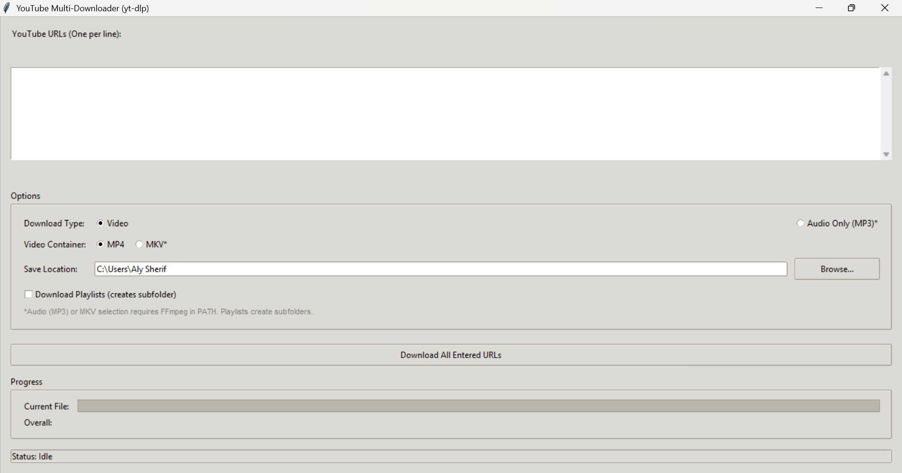

# 🐍 Python YouTube Downloader GUI (yt-dlp)

A user-friendly desktop application built with Python and Tkinter for downloading multiple YouTube videos or audio streams using the powerful `yt-dlp` library. Features batch downloading, format selection (MP4/MKV video, MP3 audio), and automatic playlist handling.

---

## ✨ Preview

<!-- TODO: Add a screenshot!
1. Run your application.
2. Take a screenshot (using Snipping Tool, ShareX, etc.).
3. Create a folder named 'images' in your project directory.
4. Save the screenshot as 'screenshot.png' (or similar) inside the 'images' folder.
5. Replace the path below if you use a different filename/path.
-->


---

## 🚀 Features

*   **User-Friendly GUI:** Simple and intuitive interface built with Tkinter.
*   **Batch Downloading:** Paste multiple YouTube URLs (one per line) for bulk downloading.
*   **Video Downloads:**
    *   Download videos in the best available quality.
    *   Choose between **MP4** and **MKV** containers (MKV requires FFmpeg).
*   **Audio-Only Downloads:**
    *   Extract audio and save as **MP3** (requires FFmpeg).
*   **Playlist Support:**
    *   Optionally download entire playlists.
    *   Automatically creates a subfolder named after the playlist.
    *   Files within the playlist folder are numbered sequentially.
*   **Progress Tracking:**
    *   Individual file progress bar with speed and ETA.
    *   Overall progress indicator for batch downloads.
*   **Status Updates:** Clear messages indicating the current status (Idle, Downloading, Finished, Error, Cancelled).
*   **Cross-Platform:** Should work on Windows, macOS, and Linux (requires Python and dependencies).

---

## 📋 Prerequisites

*   **Python:** Version 3.7 or higher recommended. Download from [python.org](https://www.python.org/downloads/).
*   **pip:** Python's package installer (usually comes with Python).
*   **yt-dlp:** The core download library. Installed via pip.
*   **⚠️ FFmpeg:** **Required** for:
    *   Downloading videos in the **MKV** format.
    *   Converting downloads to **MP3** audio.
    *   Merging separate video and audio streams downloaded by `yt-dlp` (often needed for high-quality formats).
    *   Download from [ffmpeg.org](https://ffmpeg.org/download.html).
    *   **Crucially, FFmpeg must be added to your system's PATH environment variable** so the script (and `yt-dlp`) can find it. Verify by opening a terminal/command prompt and typing `ffmpeg -version`.

---

## ⚙️ Installation

1.  **Clone the Repository:**
    ```bash
    git clone https://github.com/AliSherif1309/python-yt-dlp-gui.git
    ```
    <!-- TODO: Replace YourUsername/your-repository-name -->

2.  **Install Python Dependencies:**
    It's highly recommended to use a Python virtual environment:
    ```bash
    # Create a virtual environment (optional but recommended)
    python -m venv venv
    # Activate it (Windows)
    .\venv\Scripts\activate
    # Activate it (macOS/Linux)
    source venv/bin/activate

    # Install required packages
    pip install -r requirements.txt
    ```
    This will install `yt-dlp` from the included `requirements.txt` file.

3.  **Install FFmpeg:**
    *   Download FFmpeg from the official website: [ffmpeg.org](https://ffmpeg.org/download.html) (Look for pre-built static binaries for your OS).
    *   Extract the downloaded archive.
    *   **Add the `bin` directory** (containing `ffmpeg.exe`, `ffprobe.exe`, etc.) **to your system's PATH environment variable.** Guides for adding to PATH are easily found online for Windows, macOS, and Linux.

---

## ▶️ Usage

1.  Make sure you have activated your virtual environment if you created one (`.\venv\Scripts\activate` or `source venv/bin/activate`).
2.  Run the Python script from your terminal:
    ```bash
    python yt_downloader_gui.py
    ```
    <!-- TODO: Replace yt_downloader_gui.py with your actual script filename if different -->

3.  The application window will appear.
4.  Paste YouTube URLs (one per line) into the text box.
5.  Select your desired download options (Video/Audio, MP4/MKV, Playlist handling).
6.  Browse for a save location.
7.  Click "Download All Entered URLs".
8.  Monitor the progress and status messages.

---

## ❗ Important Notes

*   **FFmpeg is essential** for MP3 audio output and MKV video output. If FFmpeg is not found in your PATH, these options will likely fail during the post-processing stage.
*   Downloading copyrighted material may be illegal in your country. Use this tool responsibly and respect copyright laws.
*   YouTube's website structure changes occasionally, which might break `yt-dlp`. Keep `yt-dlp` updated (`pip install --upgrade yt-dlp`) if you encounter issues.

---

## 🙌 Contributing

Contributions are welcome! If you have suggestions or find bugs, please feel free to open an issue or submit a pull request.

1.  Fork the Project
2.  Create your Feature Branch (`git checkout -b feature/AmazingFeature`)
3.  Commit your Changes (`git commit -m 'Add some AmazingFeature'`)
4.  Push to the Branch (`git push origin feature/AmazingFeature`)
5.  Open a Pull Request

---

<!-- Optional: Add Contact/Acknowledgement section -->
